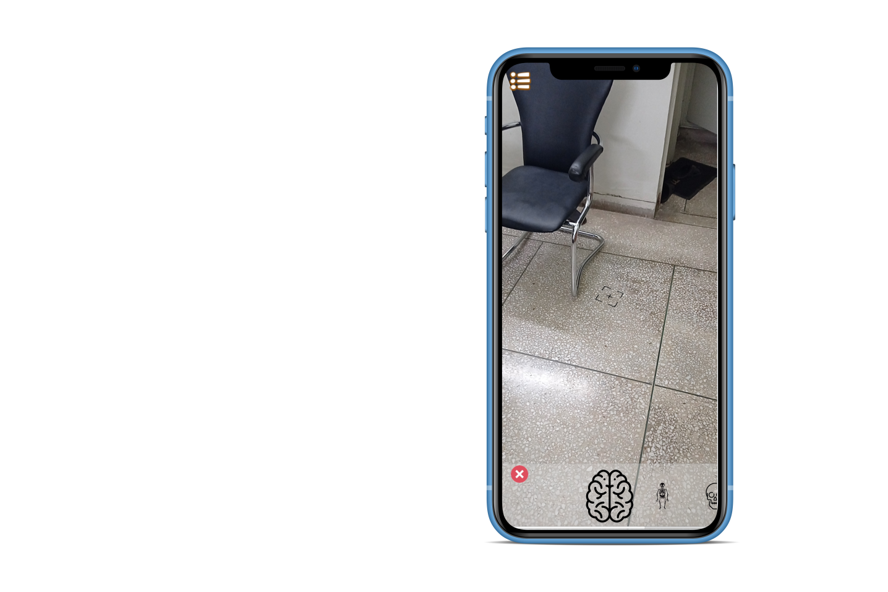
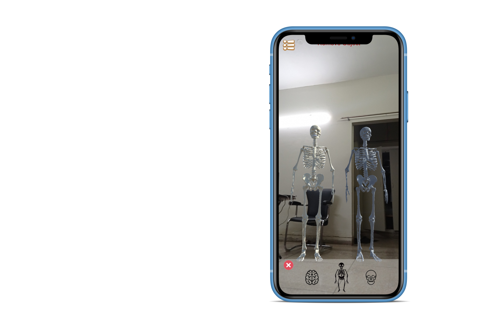
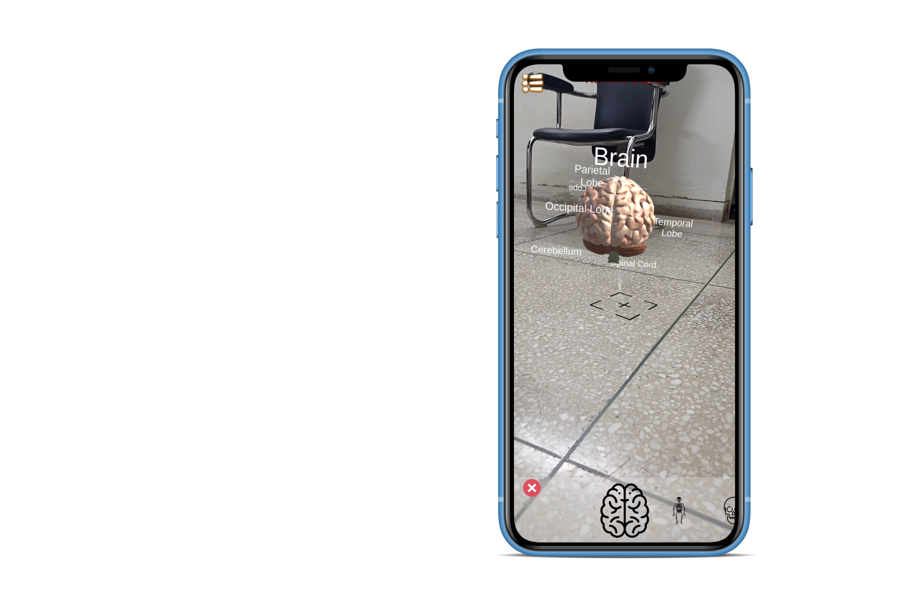
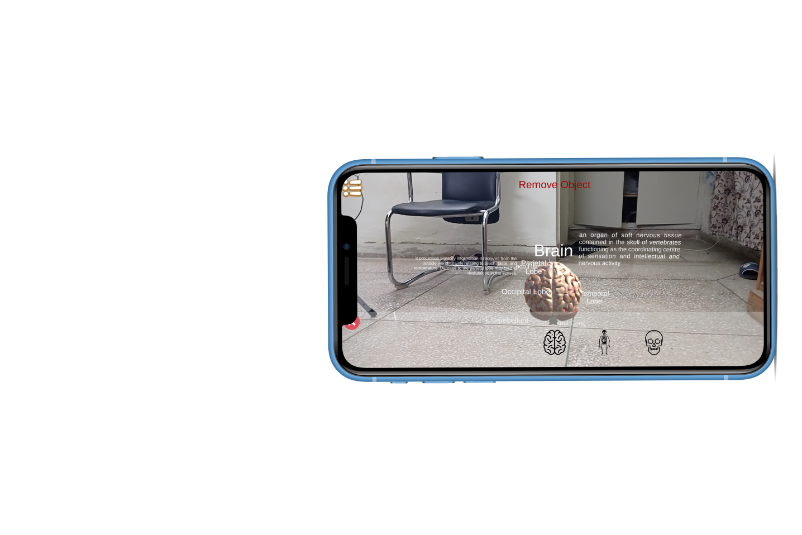
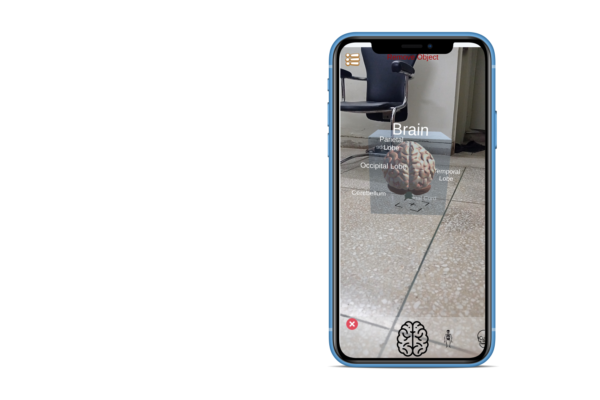
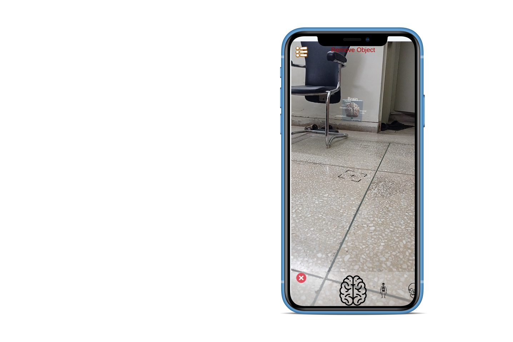

# Human Anatomy in AR

This project is developed using Unity game engine, with ARCore and XR interaction toolkit. For Authentication Firebase is being used.

The main idea this project is to augment 3D models of human anatomy on a smart phone and provide information about that specific part which the user wants to examine.

## Surface Detection

First when you open the camera (after authentication), the program will first detect your surface using surface detection algorithm and a crosshair will be placed on the surface.

## Augment Object 

First you'll select the object that you want to augment from the custom scroll view at the bottom of the screen. Then You can tap on the screen to Augment the object on the position of the crosshair

## View Labels

If you look directly at the object then you can view it's labels

## Transform

First you'll select the object by tapping. Then you can scale/move/rotate the object with your gestures.

